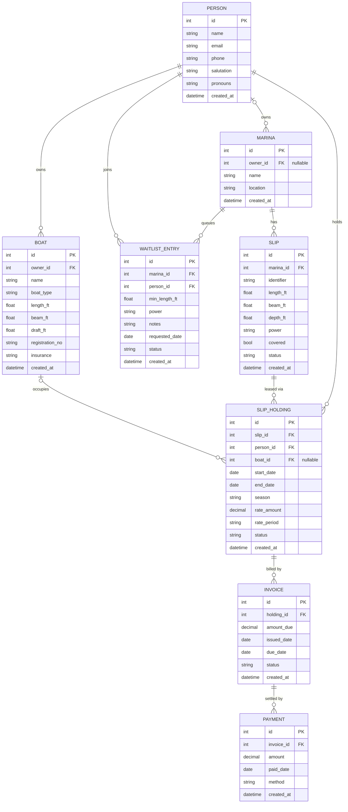

# Storable — Data Model

Entity-relationship diagram for the slip-management schema. Every box is a table;
`PK` marks its primary key, `FK` marks a foreign key. The crow's-foot lines show
how the rows map to one another.

## Reading the lines (crow's-foot notation)

The symbol nearest each box states how many of *that* entity participate:

| Symbol | Means |
|--------|-------|
| `||`   | exactly one |
| `o|`   | zero or one |
| `}o`   | zero or more (the "crow's foot") |
| `}|`   | one or more |

So `MARINA ||--o{ SLIP` reads: **one** marina relates to **zero-or-more** slips —
and, read back the other way, each slip belongs to **exactly one** marina.

## Foreign-key reference

| Child table      | FK column     | → Parent table | Cardinality | Nullable? |
|------------------|---------------|----------------|-------------|-----------|
| `marinas`        | `owner_id`    | `people`       | many → 1    | **yes**   |
| `slips`          | `marina_id`   | `marinas`      | many → 1    | no        |
| `boats`          | `owner_id`    | `people`       | many → 1    | no        |
| `slip_holdings`  | `slip_id`     | `slips`        | many → 1    | no        |
| `slip_holdings`  | `person_id`   | `people`       | many → 1    | no        |
| `slip_holdings`  | `boat_id`     | `boats`        | many → 1    | **yes**   |
| `invoices`       | `holding_id`  | `slip_holdings`| many → 1    | no        |
| `payments`       | `invoice_id`  | `invoices`     | many → 1    | no        |
| `waitlist_entries`| `marina_id`  | `marinas`      | many → 1    | no        |
| `waitlist_entries`| `person_id`  | `people`       | many → 1    | no        |

**Note:** every relationship in this schema is **one-to-many** — there are no
one-to-one relationships. Two foreign keys are *nullable*, so the child maps to
**zero-or-one** parent rather than exactly one:

- `boat_id` on `slip_holdings` — a slip can be leased before a specific boat is
  assigned.
- `owner_id` on `marinas` — a marina can exist before its owning person (the
  lessor who rents slips out) is recorded.
